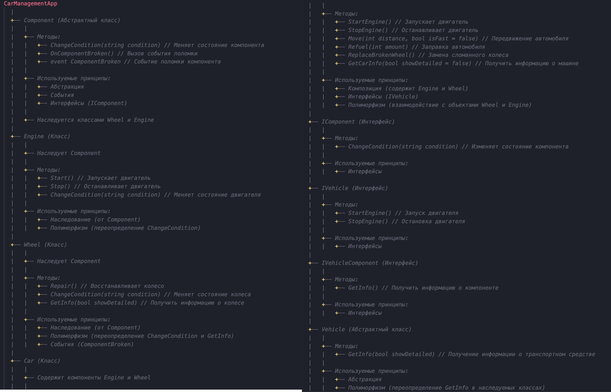

# Проект по управлению автомобилями 

## Описание
Данный проект реализует систему управления автомобилями, где можно добавлять автомобили в автопарк, заправлять их, перемещать, менять колеса, а также отслеживать состояние двигателя и колес.

## UML

## Структура классов

### 1. **Car** (Класс автомобиля)
- Класс, который управляет всеми аспектами автомобиля, такими как состояние двигателя, колеса, пробег и топливо.
- Методы:
  - `StartEngine()`: Запуск двигателя.
  - `StopEngine()`: Остановка двигателя.
  - `Move()`: Перемещение автомобиля, с поддержкой ускоренного режима.
  - `Refuel()`: Заправка автомобиля.
  - `ReplaceBrokenWheel()`: Замена сломанных колес.
  - `GetCarInfo()`: Получение информации о состоянии автомобиля с возможностью отображения подробной информации.

**Полиморфизм:**
- `Car` использует полиморфизм для обработки различных видов движения автомобиля через перегрузку метода `Move`. Этот метод имеет две версии: с параметром высокой скорости и без него.

**Наследование:**
- Класс `Car` наследует функциональность от абстрактного класса `Vehicle`.

### 2. **Engine** (Класс двигателя)
- Класс, который управляет состоянием двигателя автомобиля.
- Методы:
  - `Start()`: Запуск двигателя.
  - `Stop()`: Остановка двигателя.
  - `ChangeCondition()`: Изменение состояния двигателя (например, сломан или работает).
  
**Override:**
- Метод `ChangeCondition()` в классе `Engine` переопределяет аналогичный метод в классе `Component`, обеспечивая уникальное поведение для изменения состояния двигателя.

**Абстракция:**
- Класс `Engine` абстрагирует состояние и управление двигателем, позволяя наследникам, таким как `Car`, легко манипулировать состоянием двигателя через общие методы.

### 3. **Wheel** (Класс колеса)
- Класс, который управляет состоянием колеса автомобиля.
- Методы:
  - `Repair()`: Восстановление колеса в рабочее состояние.
  - `ChangeCondition()`: Изменение состояния колеса (например, "Новое" или "Сломано").
  - `GetInfo()`: Получение информации о состоянии колеса.

**Абстракция и Полиморфизм:**
- Класс `Wheel` использует абстракцию для работы с состоянием колеса через интерфейс `IComponent`.
- Используется полиморфизм в методах работы с компонентами.

### 4. **Component** (Абстрактный класс компонента)
- Абстрактный класс для всех компонентов автомобиля (например, двигатель и колесо).
- Содержит методы и события для изменения состояния компонента и обработки его поломки.
- Методы:
  - `ChangeCondition()`: Изменяет состояние компонента и вызывает событие поломки, если состояние — "Сломано".
  - `OnComponentBroken()`: Защищённый метод для срабатывания события поломки компонента.

**Интерфейсы:**
- Класс реализует интерфейс `IComponent`, который определяет основные методы для компонентов, такие как `ChangeCondition()` и `GetInfo()`.

### 5. **Vehicle** (Абстрактный класс транспортного средства)
- Абстрактный класс для всех транспортных средств, определяет базовые методы для работы с транспортом.
- Метод:
  - `GetInfo()`: Метод для получения информации о транспортном средстве. Это метод с полиморфизмом, так как может быть переопределен в наследниках.

### 6. **IComponent** (Интерфейс компонента)
- Интерфейс для всех компонентов автомобиля, таких как двигатель или колесо.
- Методы:
  - `ChangeCondition()`: Для изменения состояния компонента.
  - `GetInfo()`: Для получения информации о компоненте.

### 7. **IVehicle** (Интерфейс транспортного средства)
- Интерфейс для всех транспортных средств.
- Методы:
  - `StartEngine()`: Запуск двигателя.
  - `StopEngine()`: Остановка двигателя.

### 8. **IVehicleComponent** (Интерфейс компонента транспортного средства)
- Интерфейс для компонентов, которые могут быть частью транспортных средств.
- Метод:
  - `GetInfo()`: Получение информации о компоненте.

## Реализованные требования из методички:
- **Использование классов**: Да, использованы классы `Car`, `Engine`, `Wheel`, `CarPark` и другие.
- **Полиморфизм**: Да, реализованы перегрузки метода `Move` и переопределение метода `GetInfo()` для компонентов и транспортных средств.
- **Абстракция**: Да, использованы абстрактные классы `Component` и `Vehicle` для обобщенной работы с компонентами и транспортными средствами.
- **Наследование**: Да, класс `Car` наследует функциональность от абстрактного класса `Vehicle`, и другие компоненты наследуют `Component`.
- **Интерфейсы**: Да, реализованы интерфейсы `IComponent`, `IVehicle`, `IVehicleComponent` для различных компонентов и транспортных средств.
- **События**: Да, класс `Component` реализует события поломки для всех компонентов.
- **Перегрузка методов**: Да, методы для перемещения и отображения информации о транспортных средствах перегружены.
- **Диаграмма классов UML**: Да, предоставлена диаграмма классов для визуализации структуры приложения.

## Как использовать:
1. Создайте автомобиль с помощью кнопки "Создать авто".
2. Запустите или остановите двигатель.
3. Перемещайте автомобиль с возможностью выбора высокой скорости.
4. Заправляйте автомобиль.
5. Заменяйте сломанные колеса.
6. Получайте информацию о транспортных средствах и их компонентах.
